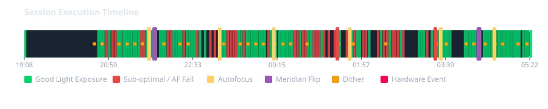
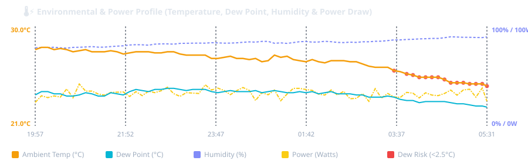
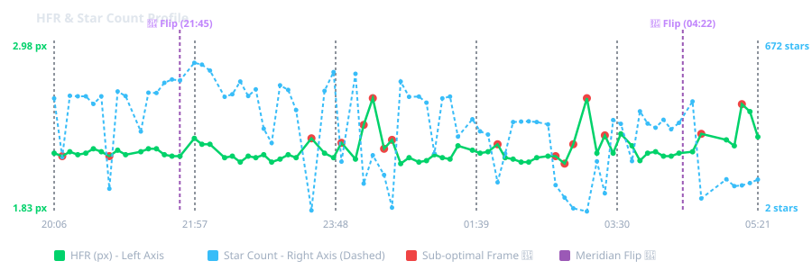

#  Overnight Capture Diagnostics for N.I.N.A.

<br>

[](https://opensource.org/licenses/MIT)
[](https://nighttime-imaging.eu/)

**Overnight Capture Diagnostics (OCD)** is an automated, intelligent session analytics and diagnostic reporting plugin for **N.I.N.A. (Nighttime Imaging 'N' Astronomy)**.

At the end of an imaging night—or on-demand for historic session logs—OCD parses your N.I.N.A. log files, image telemetry headers, guiding data, and equipment profiles to compile publication-ready **Markdown (`.md`)** and rich **HTML (`.html`)** diagnostic reports complete with embedded vector SVG charts.

---

## 💾 Installation

### 1. Recommended: N.I.N.A. Plugin Store (Automatic)
The easiest way to install the plugin is directly through the official N.I.N.A. Plugin Store:
1. Open N.I.N.A. and navigate to the **Plugins** tab on the left sidebar.
2. Select **Available** in the top tab menu.
3. Locate **Overnight Capture Diagnostics** (use the search bar if needed) and click **Install**.
4. Restart N.I.N.A. to activate.

### 2. Manual Installation (For Development & Offline PCs)
If you need to install the plugin manually from a custom compiled build or on an offline computer:
1. Download or compile the release binaries.
2. Navigate to your local AppData directory:  
   `%LOCALAPPDATA%\NINA\Plugins\3.0.0\` (typically `C:\Users\<YourUsername>\AppData\Local\NINA\Plugins\3.0.0\`).
3. Create a new subfolder named **`Overnight Capture Diagnostics`**.
4. Copy the compiled binary files into that directory:
   - `NirZonshine.NINA.OvernightCaptureDiagnostics.dll`
   - `NirZonshine.NINA.OvernightCaptureDiagnostics.pdb`
   - `NirZonshine.NINA.OvernightCaptureDiagnostics.deps.json`
   - `NirZonshine.NINA.OvernightCaptureDiagnostics.runtimeconfig.json`
   - `manifest.json`
5. Restart N.I.N.A. to activate.

---

## ✨ Key Features

- **Flexible Sequencer Integration**: Supports both lightweight end-of-night diagnostics and full real-time telemetry monitoring:
  - **Standard Session Diagnostics**: Simply drop the **`[OCD] Overnight Capture Diagnostics`** instruction at the end of your sequence (e.g., after parking your scope) to analyze logs, image telemetry, autofocus routines, meridian flips, and optical metrics.
  - **Real-time Power & Environmental Monitoring**: Additionally place the **`Start OCD Telemetry`** instruction at the beginning of your imaging night (e.g., inside your *Startup* container) to monitor ASCOM power switches, energy consumption ($\text{Wh}$ / $\text{Ah}$), and dew prevention in the background.
- **24-Hour Astronomical Observing Window**: Live Session mode automatically calculates the strict 24-hour observing window (**12:00 PM noon to 12:00 PM noon next day**) to strictly isolate last night's imaging session without accumulating previous nights' logs. Historic mode scans from 12:00 PM on the requested date to 12:00 PM the following day.
- **N.I.N.A. 3.2 & Modern Filename Telemetry Extraction**: Dynamic template-driven parsing of N.I.N.A.`$$TAG$$` file save patterns (`$$SENSORTEMP$$`, `$$EXPOSURETIME$$`, `$$HFR$$`, `$$STARCOUNT$$`, `$$RMS$$`, `$$FILTER$$`, `$$TARGETNAME$$`) across `.fits`, `.fit`, `.tif`, and `.xisf` images. Accurately extracts signed sensor temperatures (e.g. `-5.00°C`) without requiring `"C"` or `"TEMP"` prefixes.
- **Single Execution Summary Logging**: Logs a clean, versioned execution summary entry (e.g. `[Overnight Capture Diagnostics v1.0.5.0] Created Live report 'OCD_Report_...html'. Debug Mode: Disabled`) into N.I.N.A.'s log file on every run, regardless of debug setting.
- **Filter Wheel Verification**: Strict validation prevents sequencer condition logs (`pierWest`, `Automated Flip`) from corrupting filter wheel metadata on rigs without a physical filter wheel.
- **Multi-Session & Multi-Equipment Profile Support**: Seamlessly handles N.I.N.A process restarts within a single night. Automatically organizes the report into distinct sub-sessions (`Sub-Session 1`, `Sub-Session 2`) with separate equipment tables detailing camera models, focal lengths, pixel scales, and true Field of View (FOV).
- **Offline Sensor Resolution Lookup**: Includes a built-in sensor fallback database for popular astronomy cameras (e.g., IMX462, IMX533, IMX605, IMX571/2600, IMX294, KASI1600, IMX183, IMX455/6200), ensuring accurate FOV and pixel scale calculations even when drivers are offline or disconnected.
- **Session Execution Window vs. Light Capture Telemetry**: Explicitly reports both the full N.I.N.A execution span (`SessionStart` — `SessionEnd`) and the exact **First Light Captured** — **Last Light Captured** timestamps.
- **Polar Alignment Diagnostics**: Extracts initial start error and final settled alignment error (from 2PPA or TPPA). Automatically filters out pre-flight unhomed test measurements for 100% accurate initial vs. final error readings.
- **N.I.N.A. 3.2 Meridian Flip Impact Analysis**: Detects N.I.N.A 3.2 meridian flip routines (`Meridian Flip - Initializing` → `Exiting`) and evaluates imaging quality across a 30-minute pre-flip vs. post-flip window (`HFR`, `Star Count`, and `Guiding RMS`).
- **⚡ Real-time Power & Dew Prevention Analytics**: Continuous background monitoring of ASCOM power switches and smart hubs. Automatically renders dedicated vector charts plotting instantaneous power draw (Watts) and dew heater PWM duty cycles (%), calculating total battery capacity consumption ($\text{Ah}$) and energy consumed ($\text{Wh}$).
- **Optical & Guiding Performance Summary**: Provides a complete 5-metric statistical breakdown (`Min | Max | Mean | Median | StdDev (σ)`) for `HFR (px)`, `Star Count`, and `Guiding RMS (arcsec)`. Automatically tracks unguided light frames and sub-frame health warnings.
- **Embedded Dual-Axis Vector SVG Charts**:
  - ⏱️ **Session Execution Timeline**: Gantt chart visualizing light exposures, autofocus runs, polar alignment routines, meridian flips, and idle overhead.
  - 📈 **HFR & Star Count Profile**: Dual-axis graph plotting `HFR (px)` on the left axis (solid green) and `Star Count` on the right axis (dashed cyan), complete with min/max value labels and legends.
  - 🌡️⚡ **Environmental & Power Profile**: Dual-axis graph plotting Ambient Temperature & Dew Point (°C) against Relative Humidity (%) and Instantaneous Power Draw (Watts) / Dew Heater Duty (%).
- **Automated Report Generation**: Writes formatted `.md` and `.html` report files directly to your default report folder (`%USERPROFILE%\Documents\N.I.N.A\OCD_Reports\`).

---

## ⚡ Supported & Tested Power Switches / Smart Hubs

OCD features continuous background telemetry monitoring for ASCOM power management devices and weather sensors via N.I.N.A.'s `Switch` and `WeatherData` mediators.

> [!IMPORTANT]
> **Physically Tested & Validated Hardware:**  
> The plugin has been **physically tested and confirmed working on only the following two specific devices**:
> 1. **SVBONY SV241 Pro Power Box**: **Fully Supported**. Reports complete environmental and electrical telemetry: Voltage (V), Current (A), Instantaneous Power Draw (W), Ambient Temperature (°C), Relative Humidity (%), Dew Point (°C), and Dew Heater PWM duty cycle (%).
> 2. **2026 Gemini Astro Power Box HUB USB3.2+DC ASCOM Power Box**: **Power & PWM Supported**. Successfully reports Voltage, Current, Instantaneous Power Draw (W), and Dew Heater PWM duty cycles. *Note: Does not expose ambient temperature or humidity to N.I.N.A. through the ASCOM switch interface, so environmental readings are not available from this device.*

### 🔌 Compatibility with Other ASCOM Power Switches & Smart Hubs
While the two units above are the only devices physically verified by the authors, OCD is built on generic ASCOM standards and **may work with other ASCOM power switches and smart hubs** (e.g., Pegasus Astro Powerbox, PrimaLuceLab EAGLE, WandererBox, etc.) if they satisfy the following conditions:
- **ASCOM Switch Driver**: The device provides a compliant ASCOM Switch driver connectable in N.I.N.A. under **Equipment** ➔ **Switch**.
- **Standard Telemetry Channel Naming**: The ASCOM driver labels or describes its read-only gauges and writable control channels using standard naming keywords recognized by OCD:
  - **Voltage**: Channel name contains `VOLTAGE`, `VOLTS`, `VOLT`, or `V`
  - **Current**: Channel name contains `CURRENT`, `AMPS`, `AMP`, `A`, or `MILLIAMP`/`MA`
  - **Power Draw**: Channel name contains `POWER`, `WATTS`, `WATT`, or `W` *(if power in Watts is not reported as a dedicated channel, OCD automatically calculates $P = V \times I$ whenever both Voltage and Current are available)*
  - **Dew Heaters**: Channel name contains `DEW`, `DEW HEATER`, `PWM`, `HEATER`, or `HEATING` *(OCD automatically normalizes duty cycles across $0-100\%$, $0-253$, or $0-255$ hardware scales)*
  - **Environmental Sensors**: Channel name contains `TEMP`, `TEMPERATURE`, `HUMIDITY`, `HUM`, `DEW POINT` *(either reported through switch analog gauges or via a connected N.I.N.A. **Weather** device)*

---

## 📖 Sequencer Integration & Usage

### 1. Advanced Sequencer Instructions
OCD provides two instructions in N.I.N.A.'s Advanced Sequencer:

1. **`Start OCD Telemetry`** *(Category: Utility)*:
   - Place this instruction at the **start of your imaging night** (e.g., inside your *Startup* or *Pre-imaging* sequence container).
   - Starts non-blocking background polling of connected ASCOM power switches and environmental weather sensors at regular intervals (default: 60 seconds).
2. **`[OCD] Overnight Capture Diagnostics`** *(Category: Utility)*:
   - Place this instruction at the **very end of your imaging sequence** (e.g., after target execution, flat capture, and mount parking).
   - Concludes telemetry monitoring, computes total energy/power consumption, derives session statistics, and generates both `.md` and `.html` diagnostic reports.

### 2. Configuration Options
- **Target Session Date**:
  - **Leave Blank**: Automatically analyzes today's live imaging session.
  - **Specify Date (`YYYY-MM-DD`)**: Parses historic N.I.N.A log files for that specific date.
- **Resolve Location (Privacy Option, Default: OFF)**:
  - **Unchecked (Default)**: OCD operates in 100% offline mode. Zero external network requests are made, protecting your rig's location privacy.
  - **Checked**: The plugin issues an outbound HTTPS query to the third-party **OpenStreetMap (Nominatim)** API (`https://nominatim.openstreetmap.org/reverse`) to resolve your rig's GPS coordinates into a human-readable city/region name.  
    > [!WARNING]
    > **Privacy Disclosure:** Checking "Resolve Location" transmits your rig's geographic coordinates (Latitude and Longitude) to OpenStreetMap over the internet. Keep this unchecked if you do not want your rig's location sent to third-party servers.
- **Location Name**:
  - When **Resolve Location** is unchecked, a custom "Location Name" field appears.
  - You can enter any custom label (e.g., `"Home"`, `"Texas"`, or `"Dark Sky Observatory"`), which will be displayed in the report header without making any network requests. If left blank, it cleanly defaults to your local N.I.N.A. profile site name.
- **Report Privacy Guarantee**:
  - Exact GPS coordinates (latitude/longitude) are **never printed** in generated Markdown or HTML reports, ensuring you can safely share your diagnostic reports on public forums without revealing your exact coordinates.
- **Custom Report Output Folder**: Optionally specify a custom directory where Markdown and HTML diagnostic reports should be saved.

---

## ⚙️ N.I.N.A. File Pattern Configuration & Recommendations

To compile complete per-frame health diagnostics (such as **HFR**, **Star Count**, and **Guiding RMS**), OCD dynamically analyzes the **Image File Pattern** configured in N.I.N.A. (`Options` ➔ `Imaging` ➔ `File Settings` ➔ `Image File Pattern`).

> **Important:** Sub-frame telemetry tags must be included in your N.I.N.A. File Save Pattern so that OCD can extract per-frame HFR, star counts, and RMS from saved image file paths without needing to scan raw image files on disk.

### Recommended File Pattern Examples

You can copy and paste any of the following recommended patterns directly into N.I.N.A. (**Options** ➔ **Imaging** ➔ **File Settings** ➔ **Image File Pattern**):

#### 🌟 Pattern 1: Advanced Metrics Pattern (FWHM, Eccentricity, RMS)
```
$$DATEMINUS12$$\$$IMAGETYPE$$\$$DATETIME$$_$$FILTER$$_$$SENSORTEMP$$_$$EXPOSURETIME$$s_$$FRAMENR$$_$$STARCOUNT$$_$$HFR$$_$$ECCENTRICITY$$_$$TARGETNAME$$_$$FWHM$$_$$RMSARCSEC$$
```
*Example Output Filepath:*  
`2026-09-03\LIGHT\2026-09-03_21-23-32_Ha_-10.0_300.00s_0001_950_1.38_0.42_Sh2 119_2.10_0.44.fits`

#### 🌟 Pattern 2: Comprehensive Diagnostics Pattern
```
$$TARGETNAME$$\$$IMAGETYPE$$\$$DATETIME$$_$$FILTER$$_$$EXPOSURETIME$$s_GAIN$$GAIN$$_TEMP$$SENSORTEMP$$_HFR$$HFR$$_$$STARCOUNT$$STARS_RMS$$RMS$$_$$FRAMENR$$
```
*Example Output Filepath:*  
`LDN 1235\LIGHT\2026-07-22_21-25-49_Ha_300.00s_GAIN100_TEMP-4.90_HFR2.17_193STARS_RMS0.24_0000.fits`

#### ⚡ Pattern 3: Compact Standard Pattern
```
$$TARGETNAME$$\$$IMAGETYPE$$\$$DATETIME$$_$$FILTER$$_-$$SENSORTEMP$$C_$$EXPOSURETIME$$s_$$STARCOUNT$$STARS_$$HFR$$HFR_$$RMS$$RMS_$$FRAMENR$$
```
*Example Output Filepath:*  
`IC 5146\LIGHT\2026-07-22_21-44-31_Ha_-4.90C_300.00s_837STARS_1.65HFR_0.47RMS_0000.fits`

#### 🛠️ Pattern 4: Minimal Un-prefixed Pattern
```
$$DATETIME$$_$$FILTER$$_$$SENSORTEMP$$_$$EXPOSURETIME$$s_$$FRAMENR$$_$$STARCOUNT$$_$$HFR$$_$$TARGETNAME$$_$$RMS$$
```
*Example Output Filepath:*  
`2026-07-22_21-25-49_Ha_-4.90_300.00s_0000_874_16.21_LDN 1235_0.12.fits`

---

## 📊 Sample Diagnostic Report Highlights

The following live excerpts and embedded vector charts are taken directly from an authentic overnight imaging run generated by **OCD v1.0.6.5** in Arlington, Texas, USA.

### 🌟 Session Executive Summary
> **Plugin Version:** v1.0.6.5 | **Session Date:** 2026-09-06 | **Session Start:** 2026-09-06 19:07:07 | **Session End:** 2026-09-07 05:32:49 (**Span:** 10h 25m 42s)  
> **First Light Captured:** 2026-09-06 19:08:30 | **Last Light Captured:** 2026-09-07 05:22:13 | **Astro Night Window:** 20:22 — 04:54 (8h 32m 6s)  
> **Site:** Arlington, Texas, USA | **Night Score:** 🌟 **73 / 100** | **Total Integration:** 6h 39m 3s | **Dark Sky Efficiency:** **72.5%** | **Active Duty Cycle:** **64.7%**

---

### ⏱️ Capture & Overhead Breakdown
- **Session Execution Window:** 2026-09-06 19:07:07 — 2026-09-07 05:32:49 (Total Elapsed: 10h 25m 42s)
- **First Light Frame Captured:** 2026-09-06 19:08:30
- **Last Light Frame Captured:** 2026-09-07 05:22:13
- **Astro Night Window:** 20:22 — 04:54 (8h 32m 6s)
- **Total Night Integration:** 6h 39m 3s
- **Dark Sky Efficiency:** **72.5%** (Integration within Dark Sky / Dark Sky Duration)
- **Active Imaging Duty Cycle:** **64.7%** (Integration / Active Imaging Span)
- **Total Overhead Time:** 3h 46m 39s (AutoFocus routines, passing clouds, dither settling, meridian flips)
- **Estimated Storage Consumed:** **2.24 GB** (136 total frames)
- **⚡ Total Power Consumed:** **317.1 Wh** (~26.3 Ah @ 12.1V avg | Peak: 58.0 W)

#### Real-time Vector Chart Example: Session Execution Timeline
<div align="center">

</div>

---

### 🌡️⚡ Environmental & Power Diagnostics
| Metric | Min | Max | Mean / Value | Status / Margin |
| :--- | :--- | :--- | :--- | :--- |
| **Ambient Temp (°C)** | 24.6°C | 28.1°C | **26.9°C** | Optimal |
| **Relative Humidity (%)** | 78% | 90% | **84%** | Normal |
| **Dew Point (°C)** | 22.6°C | 24.5°C | **23.8°C** | Dew Margin: 1.8°C |
| **Dew Heater Duty (%)** | 0% | 95% | **19%** | Active (Dynamic) |

#### Real-time Vector Chart Example: Environmental & Power Profile
<div align="center">

</div>

---

### 🔭 Equipment & Optical Profile
| Category | Device / Property | Details |
| :--- | :--- | :--- |
| **Camera** | SVBONY SV605CC (06180010) | Resolution: 3008 x 3008 \| Pixel Size: 11.28 µm |
| **Cooling** | Median Temp | **-5.0°C** |
| **Optics** | AT60ED | Focal Length: 360 mm, Aperture: 60 mm (f/6.0) |
| **Pixel Scale** | **6.46 arcsec/px** | Field of View: 324.01' x 324.01' |
| **Mount** | Scorpio | Guider: PHD2 |
| **Filter Wheel** | Manual Filter Wheel | Active Filters: IRUV, DUAL |
| **Focuser** | Star Focuser Pro ASCOM | Thermal Slope: 0.4 steps/°C |

---

### 🎯 Target Diagnostics: M27
- **Duration:** 5h 28m 49s (20:37 — 02:05) | **Integration:** 4h 27m 0s (89 frames)
- **Filters Used:** DUAL | **Quality Score:** 🌟 **56 / 100**
- **Sub-frame Health:** 89 frames total (**58 Good/Accepted [65.2%]**, **31 Sub-optimal [34.8%]**)
  - 🌫️ **HFR Spikes (Focus / Seeing):** 7 frames
  - ☁️ **Star Count Drops (Cloud / Obstruction):** 31 frames

#### Optical & Guiding Performance Summary
| Metric | Min | Max | Mean | Median | StdDev (σ) |
| :--- | :--- | :--- | :--- | :--- | :--- |
| **HFR (px)** | 2.11 | 2.63 | 2.23 | 2.20 | 0.10 |
| **Star Count** | 1 | 487 | 247 | 289 | 170.7 |
| **Total RMS (arcsec)** | 0.18" | 2.12" | **0.37"** | 0.30" | 0.26" |
| **Sensor Temp (°C)** | -5.1°C | -4.7°C | -5.0°C | **-5.0°C** | -- |

#### Real-time Vector Chart Example: HFR & Star Count Profile
<div align="center">

</div>

---

#### 🔄 Meridian Flip Diagnostics
| Timestamp | Duration | HFR (Pre → Post) | Star Count (Pre → Post) | Guiding RMS (Pre → Post) | Status |
| :--- | :--- | :--- | :--- | :--- | :--- |
| **21:43:51** | 5m 03s | 2.17 px → 2.22 px | 313 → 275 | 0.35" → 0.38" | ✅ **Completed Successfully** |

#### 🔍 AutoFocus Diagnostics
| Timestamp | Filter | Temp | Curve Quality (R²) | HFR (Initial → Final \| Δ) | Result |
| :--- | :--- | :--- | :--- | :--- | :--- |
| **21:37:49** | DUAL | 27.1°C | 0.96 | 1.89 px → 1.92 px (+0.03 px) | ✅ Success |
| **23:03:31** | DUAL | 27.0°C | 0.95 | 1.84 px → 1.83 px (-0.01 px) | ✅ Success |
| **00:09:12** | DUAL | 26.8°C | 0.97 | 1.86 px → 1.84 px (-0.02 px) | ✅ Success |
| **01:26:30** | DUAL | 26.6°C | -- | -- | ❌ Failed (Passing Cloud) |
| **01:41:28** | DUAL | 26.3°C | 0.99 | 1.84 px → 1.87 px (+0.03 px) | ✅ Success |

---

## 🏗️ Developer & Architecture Overview

The OCD plugin codebase is structured into clean, decoupled layers:

1. **Models (`Models/`)**:
   - `SessionData.cs`: Master session state tracking sub-sessions, integration time, quality scores, and safety aborts.
   - `TargetSessionData.cs`: Per-target statistics container (`HFR`, `Star Count`, `RMS`, `Anomalies`).
   - `EquipmentDetails.cs` & `EquipmentProfileRecord.cs`: Hardware profile records and optical calculation properties.
   - `MeridianFlipRecord.cs`, `PolarAlignmentRecord.cs`, `FrameRecord.cs`: Fine-grained telemetry records.
2. **Log Ingestion & File Pattern Parsing Engine (`Services/LogParserService.cs` & `Services/NinaFilePatternParserService.cs`)**:
   - Performs chronological multi-log ingestion, template-driven N.I.N.A tag pattern matching (`$$SENSORTEMP$$`, `$$EXPOSURETIME$$`, `$$STARCOUNT$$`, `$$HFR$$`, `$$RMS$$`), regex telemetry extraction, pier-side transition tracking, and sensor resolution fallback lookups.
3. **Statistics & Anomaly Engine (`Services/SessionStatsCalculator.cs`)**:
   - Handles downsampling, Z-score anomaly detection, 30-minute pre/post flip impact analysis, pixel-to-arcsecond RMS conversion, and star count statistics.
4. **SVG Vector Chart Generator (`Services/SvgChartGeneratorService.cs`)**:
   - Generates standalone, responsive vector SVG graphics for execution timelines and dual-axis HFR/Star Count profiles.
5. **Report Writers (`Services/MarkdownReportWriter.cs` & `Services/HtmlReportWriter.cs`)**:
   - Render publication-ready Markdown and HTML report documents.
6. **Sequencer Integration (`Sequencer/OCDSequenceItem.cs`)**:
   - Asynchronous N.I.N.A Advanced Sequencer instruction item with registered custom vector WPF UI icon.

---

## 📄 License

Distributed under the **MIT License**. See `LICENSE` for details.

*Created by Nir Zonshine.*
