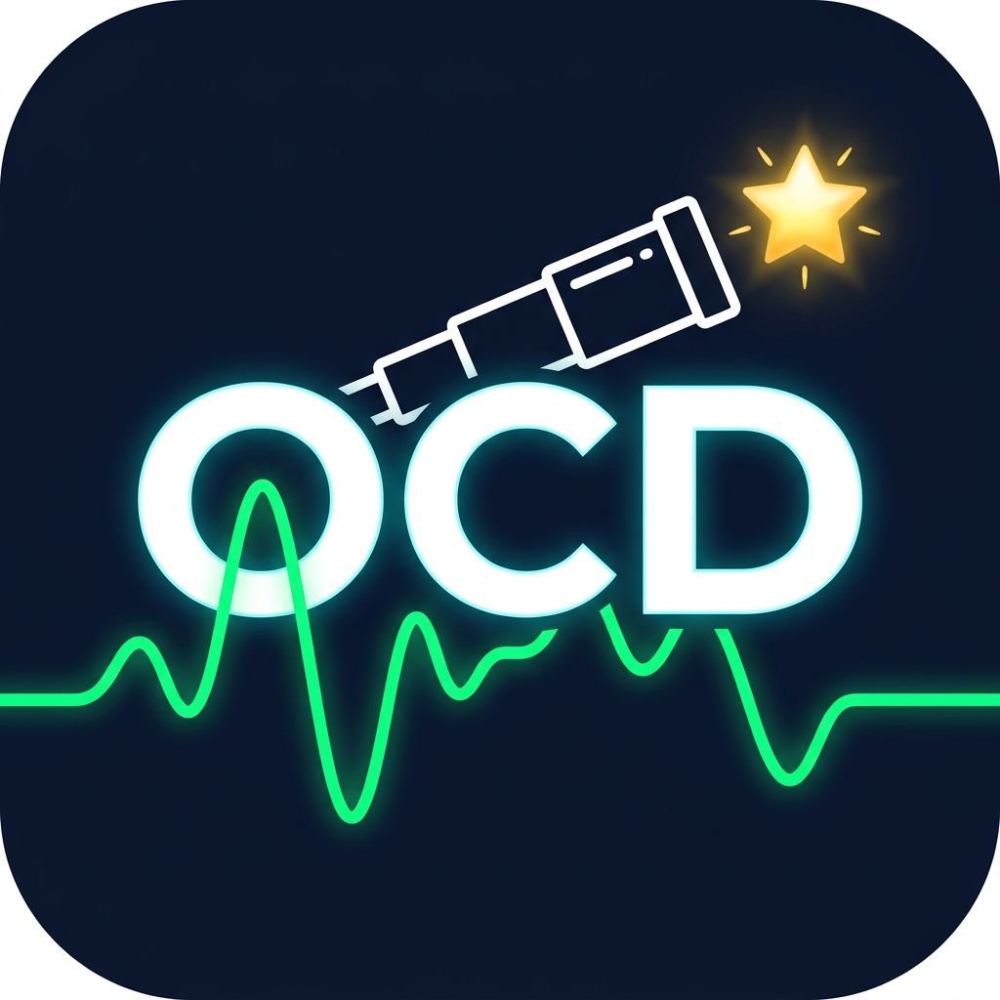

#  Overnight Capture Diagnostics for N.I.N.A.

 

**Overnight Capture Diagnostics (OCD)** is an automated, intelligent session analytics and diagnostic reporting plugin for **N.I.N.A. (Nighttime Imaging 'N' Astronomy)**.

At the end of an imaging night—or on-demand for historic session logs—OCD parses your N.I.N.A. log files, image telemetry headers, guiding data, and equipment profiles to compile publication-ready **Markdown (`.md`)** and rich **HTML (`.html`)** diagnostic reports complete with embedded vector SVG charts.

---

## 💾 Installation

### 1. Recommended: N.I.N.A. Plugin Store (Automatic)
The easiest way to install the plugin is directly through the official N.I.N.A. Plugin Store:
1. Open N.I.N.A. and navigate to the **Plugins** tab on the left sidebar.
2. Select **Available** in the top tab menu.
3. Locate **Overnight Capture Diagnostics** (use the search bar if needed) and click **Install**.
4. Restart N.I.N.A. to activate.

### 2. Manual Installation (For Development & Offline PCs)
If you need to install the plugin manually from a custom compiled build or on an offline computer:
1. Download or compile the release binaries.
2. Navigate to your local AppData directory:  
   `%LOCALAPPDATA%\NINA\Plugins\3.0.0\` (typically `C:\Users\<YourUsername>\AppData\Local\NINA\Plugins\3.0.0\`).
3. Create a new subfolder named **`Overnight Capture Diagnostics`**.
4. Copy the compiled binary files into that directory:
   - `NirZonshine.NINA.OvernightCaptureDiagnostics.dll`
   - `NirZonshine.NINA.OvernightCaptureDiagnostics.pdb`
   - `NirZonshine.NINA.OvernightCaptureDiagnostics.deps.json`
   - `NirZonshine.NINA.OvernightCaptureDiagnostics.runtimeconfig.json`
   - `manifest.json`
5. Restart N.I.N.A. to activate.

---

## ✨ Key Features

- **Automated Sequencer Instruction**: Simply drop the **`[OCD] Overnight Capture Diagnostics`** instruction item into your Advanced Sequencer container (typically at the very end of your sequence after parking your scope).
- **24-Hour Astronomical Observing Window**: Live Session mode automatically calculates the strict 24-hour observing window (**12:00 PM noon to 12:00 PM noon next day**) to strictly isolate last night's imaging session without accumulating previous nights' logs. Historic mode scans from 12:00 PM on the requested date to 12:00 PM the following day.
- **N.I.N.A. 3.2 & Modern Filename Telemetry Extraction**: Seamlessly parses `.fits`, `.fit`, `.tif`, and `.xisf` image save paths (handling N.I.N.A 3.2 duration metadata extensions). Automatically extracts `HFR`, `Star Count`, `Filter`, `Gain`, `Sensor Temp`, and `Guiding RMS` (e.g., `RMS0.24`) directly from image filenames when standalone PHD2 log files are absent.
- **Multi-Session & Multi-Equipment Profile Support**: Seamlessly handles N.I.N.A process restarts within a single night. Automatically organizes the report into distinct sub-sessions (`Sub-Session 1`, `Sub-Session 2`) with separate equipment tables detailing camera models, focal lengths, pixel scales, and true Field of View (FOV).
- **Offline Sensor Resolution Lookup**: Includes a built-in sensor fallback database for popular astronomy cameras (e.g., IMX462, IMX533, IMX605, IMX571/2600, IMX294, KASI1600, IMX183, IMX455/6200), ensuring accurate FOV and pixel scale calculations even when drivers are offline or disconnected.
- **Session Execution Window vs. Light Capture Telemetry**: Explicitly reports both the full N.I.N.A execution span (`SessionStart` — `SessionEnd`) and the exact **First Light Captured** — **Last Light Captured** timestamps.
- **Polar Alignment Diagnostics**: Extracts initial start error and final settled alignment error (from 2PPA or TPPA). Automatically filters out pre-flight unhomed test measurements for 100% accurate initial vs. final error readings.
- **N.I.N.A. 3.2 Meridian Flip Impact Analysis**: Detects N.I.N.A 3.2 meridian flip routines (`Meridian Flip - Initializing` → `Exiting`) and evaluates imaging quality across a 30-minute pre-flip vs. post-flip window (`HFR`, `Star Count`, and `Guiding RMS`).
- **Optical & Guiding Performance Summary**: Provides a complete 5-metric statistical breakdown (`Min | Max | Mean | Median | StdDev (σ)`) for `HFR (px)`, `Star Count`, and `Guiding RMS (arcsec)`. Automatically tracks unguided light frames and sub-frame health warnings.
- **Embedded Dual-Axis Vector SVG Charts**:
  - ⏱️ **Session Execution Timeline**: Gantt chart visualizing light exposures, autofocus runs, polar alignment routines, meridian flips, and idle overhead.
  - 📈 **HFR & Star Count Profile**: Dual-axis graph plotting `HFR (px)` on the left axis (solid green) and `Star Count` on the right axis (dashed cyan), complete with min/max value labels and legends.
- **Automated Report Generation**: Writes formatted `.md` and `.html` report files directly to your default report folder (`%USERPROFILE%\Documents\N.I.N.A\OCD_Reports\`).

---

## 📖 Sequencer Integration & Usage

### Adding to the Advanced Sequencer
1. In N.I.N.A., go to the **Sequencer** tab.
2. Search for **Overnight Capture Diagnostics** in the instruction palette.
3. Drag and drop the item into your end-of-night sequence container (e.g., after target execution, flat capture, and mount parking).

### Configuration Options
- **Target Session Date**:
  - **Leave Blank**: Automatically analyzes today's live imaging session.
  - **Specify Date (`YYYY-MM-DD`)**: Parses historic N.I.N.A log files for that specific date.
- **Custom Report Output Folder**: Optionally specify a custom directory where Markdown and HTML diagnostic reports should be saved.

---

## 📊 Sample Diagnostic Report Highlights

### Equipment & Optical Profile
| Category | Device / Property | Details |
| :--- | :--- | :--- |
| **Camera** | SVBONY SV605CC | Resolution: 3008 x 3008 \| Pixel Size: 3.76 µm |
| **Optics** | Refractor Scope | Focal Length: 360 mm \| f/4.8 |
| **Pixel Scale** | **2.15 arcsec/px** | Field of View: 108.00' x 108.00' |

### Optical & Guiding Performance Summary
| Metric | Min | Max | Mean | Median | StdDev (σ) |
| :--- | :--- | :--- | :--- | :--- | :--- |
| **HFR (px)** | 2.15 | 2.31 | 2.20 | 2.20 | 0.02 |
| **Star Count** | 166 | 250 | 209 | 213 | 18.4 |
| **Total RMS (arcsec)** | 0.43" | 1.08" | **0.56"** | 0.54" | 0.08" |

### 🔄 Meridian Flip Diagnostics
| Timestamp | Duration | HFR (Pre → Post) | Star Count (Pre → Post) | Guiding RMS (Pre → Post) | Status |
| :--- | :--- | :--- | :--- | :--- | :--- |
| **01:58:32** | 1m 00s | 2.21 px → 2.19 px | 220 → 226 | 0.55" → 0.58" | ✅ **Completed Successfully** |

---

## 🏗️ Developer & Architecture Overview

The OCD plugin codebase is structured into clean, decoupled layers:

1. **Models (`Models/`)**:
   - `SessionData.cs`: Master session state tracking sub-sessions, integration time, quality scores, and safety aborts.
   - `TargetSessionData.cs`: Per-target statistics container (`HFR`, `Star Count`, `RMS`, `Anomalies`).
   - `EquipmentDetails.cs` & `EquipmentProfileRecord.cs`: Hardware profile records and optical calculation properties.
   - `MeridianFlipRecord.cs`, `PolarAlignmentRecord.cs`, `FrameRecord.cs`: Fine-grained telemetry records.
2. **Log Ingestion & Parsing Engine (`Services/LogParserService.cs`)**:
   - Performs chronological multi-log ingestion, regex telemetry extraction, pier-side transition tracking, and sensor resolution fallback lookups.
3. **Statistics & Anomaly Engine (`Services/SessionStatsCalculator.cs`)**:
   - Handles downsampling, Z-score anomaly detection, 30-minute pre/post flip impact analysis, pixel-to-arcsecond RMS conversion, and star count statistics.
4. **SVG Vector Chart Generator (`Services/SvgChartGeneratorService.cs`)**:
   - Generates standalone, responsive vector SVG graphics for execution timelines and dual-axis HFR/Star Count profiles.
5. **Report Writers (`Services/MarkdownReportWriter.cs` & `Services/HtmlReportWriter.cs`)**:
   - Render publication-ready Markdown and HTML report documents.
6. **Sequencer Integration (`Sequencer/OCDSequenceItem.cs`)**:
   - Asynchronous N.I.N.A Advanced Sequencer instruction item with registered custom vector WPF UI icon.

---

## 📄 License

Distributed under the **MIT License**. See `LICENSE` for details.

*Created by Nir Zonshine.*
